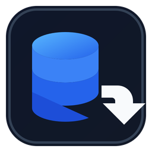

<div align="center">



# TBL to SQL Studio

**Knight Online Item Table → SQL Converter**

[]()
[]()
[]()
[]()

---

</div>

## 📖 Overview

**TBL to SQL Studio** is a native C++17 / Win32 desktop application that converts Knight Online `Item_Org` and `Item_Ext` table data into ready-to-execute `USKO_ITEM.sql` files. Built for private server developers who need to quickly import or update item data in their SQL Server databases.

## 📥 Quick Download

> **Just want the exe? Download directly:**

| File | Architecture | Description |
|------|:---:|-------------|
| **[`TBLtoSQLStudio_x64.exe`](dist/TBLtoSQLStudio_x64.exe)** | x64 | Pre-built 64-bit executable |

Click the filename → then click **"Download raw file"** button on the next page.

## ✨ Features

| Feature | Description |
|---------|-------------|
| 🔄 **TBL → SQL Conversion** | Convert `Item_Org` / `Item_Ext` source data into SQL insert scripts |
| 🌐 **Bilingual UI** | Turkish & English language switcher with persistent selection |
| 🎨 **Dark Modern Interface** | Native Windows dark-themed card-based layout |
| 🎯 **Drag & Drop** | Drop folders directly onto the window |
| ⚡ **Background Processing** | UI stays responsive during long operations |
| 📊 **Live Progress** | Double-buffered progress bar with percentage and stage text |
| 💾 **Save As Dialogs** | Export SQL and report files to any location |
| 📂 **Auto-Open Output** | Optionally open the output folder after success |
| 📋 **Activity Log** | Copy or clear the operation log |
| 🖥️ **DPI-Aware** | Windows 10/11 dark title bar with proper scaling |
| 🏗️ **x64 & x86** | Builds for both architectures |

## 🚀 Getting Started

### Build with Visual Studio 2022

1. Open `TBLtoSQLStudio.sln`
2. Select **Release | x64**
3. Build Solution

Output: `bin/Release/TBLtoSQLStudio.exe`

### Build with CMake

```bat
cmake -S . -B build -A x64
cmake --build build --config Release --parallel
```

Output: `build/Release/TBLtoSQLStudio.exe`

### Quick Build

```powershell
./build_msvc.bat
```

## 📂 Repository Layout

```
src/
  └─ TBLtoSQLStudio.cpp         ─  Conversion engine + native GUI
resources/
  ├─ tbltosql.ico                ─  Application icon
  ├─ resource.h                  ─  Resource IDs
  └─ app.manifest               ─  DPI-aware manifest
assets/
  ├─ tbltosql_icon.svg           ─  Editable vector icon
  ├─ tbltosql_icon_256.png       ─  256px icon
  └─ tbltosql_icon_512.png       ─  512px icon
TBLtoSQLStudio.sln               ─  Visual Studio 2022 solution
TBLtoSQLStudio.vcxproj            ─  VS project file
TBLtoSQLStudio.rc                 ─  Icon, manifest & version resources
CMakeLists.txt                    ─  CMake build configuration
build_msvc.bat                    ─  Quick MSVC build script
.github/workflows/build.yml      ─  CI/CD workflow
CHANGELOG.md                      ─  Version history
```

## 📋 Usage

1. Build or download the exe
2. Launch **TBL to SQL Studio**
3. Select the folder containing your `Item_Org` / `Item_Ext` table files
4. Click **Convert**
5. Save the generated `.sql` file
6. Execute the SQL on your Knight Online database

## ⚠️ Notes

- No console window — pure Windows GUI subsystem
- No external dependencies — single standalone exe
- This tool is for private server development and educational purposes

---

<div align="center">

**Made by [AKAZA](https://github.com/akazaio)**

</div>
